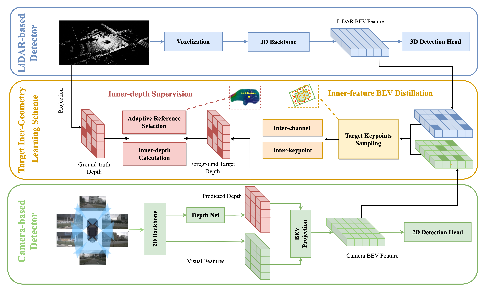

# TIG-BEV: Multi-view BEV 3D Object Detection via Target Inner-Geometry Learning </h1>

## Abstract

To achieve accurate and low-cost 3D object detection, existing methods propose to benefit camera-based multiview detectors with spatial cues provided by the LiDAR modality, e.g., dense depth supervision and bird-eye-view(BEV) feature distillation. However, they directly conduct point-to-point mimicking from LiDAR to camera, which neglects the inner-geometry of foreground targets and suffers from the modal gap between 2D-3D features. In this paper, we propose the learning scheme of Target Inner-Geometry from the LiDAR modality into camera-based BEV detectors for both dense depth and BEV features, termed as TiG-BEV. First, we introduce an inner-depth supervision module to learn the low-level relative depth relations between different foreground pixels. This enables the camerabased detector to better understand the object-wise spatial structures. Second, we design an inner-feature BEV distillation module to imitate the high-level semantics of different keypoints within foreground targets. To further alleviate the BEV feature gap between two modalities, we adopt both inter-channel and inter-keypoint distillation for feature-similarity modeling. With our target inner-geometry distillation, TiG-BEV can effectively boost BEVDepth by +2.3% NDS and +2.4% mAP, along with BEVDet by +9.1% NDS and +10.3% mAP on nuScenes val set.

